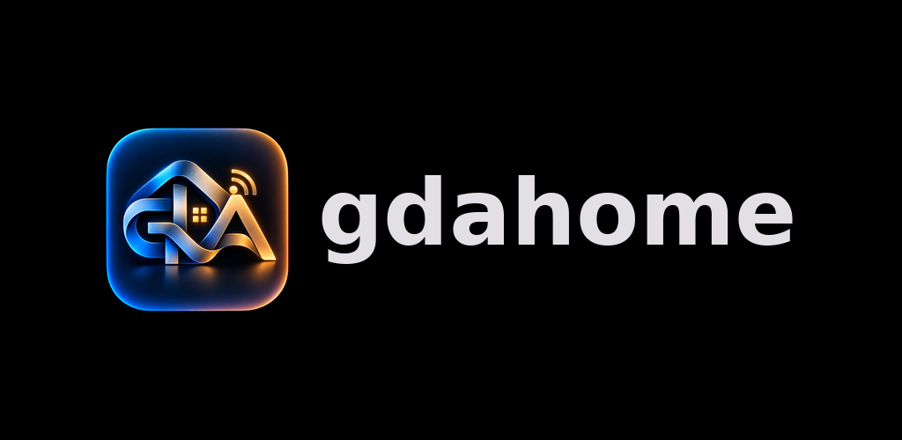
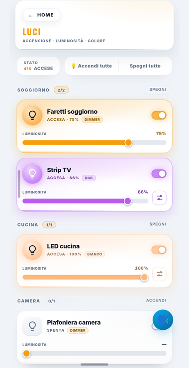
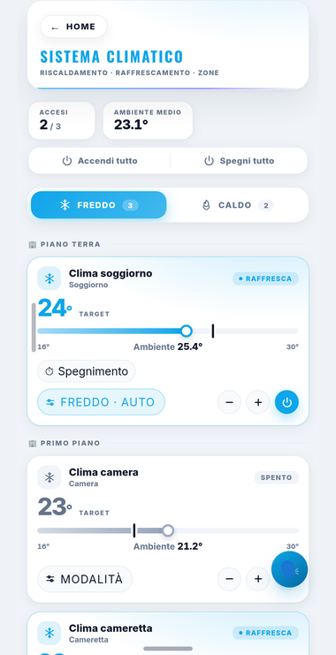
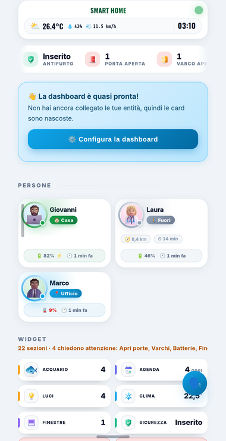

<p align="center">
  
</p>

<h3 align="center">La tua casa in una plancia.</h3>

<p align="center">
  Home Assistant sul telefono, in una pagina sola fatta per essere guardata:<br>
  le luci, il clima, le tapparelle, le telecamere, i consumi, le persone.
</p>

<p align="center">
  <a href="https://gdahome.org"><b>Il sito</b></a>
  &nbsp;·&nbsp;
  <a href="https://webapp.gdahome.org"><b>Aprila dal browser</b></a>
  &nbsp;·&nbsp;
  <a href="COME_PROVARLA.md"><b>Come si prova</b></a>
  &nbsp;·&nbsp;
  <a href="https://gdahome.org/privacy.html"><b>Privacy</b></a>
</p>

<p align="center">
  
  
  
</p>

---

Quello che in Home Assistant sta in dieci pagine diverse, qui sta dove lo
cerchi. Sono due pezzi, e lavorano insieme:

- **un add-on** che si installa in Home Assistant, serve la plancia al telefono
  e tiene il segreto della casa — quello non esce mai da lì;
- **un'app** per Android, iPhone e browser, che si abbina inquadrando un codice
  a quadretti: nessuna password da inserire, nessun token da copiare, nessuna
  porta da aprire sul router.

## Metterla in casa

**Impostazioni → Add-on → Negozio degli add-on**, i tre puntini in alto a
destra → **Archivi**, e si incolla:

```
https://github.com/danigio15/gdahomeapp
```

Nell'elenco compare **gdahome**: si installa e si avvia. La prima volta ci
mette qualche minuto — su un Raspberry anche dieci — perché Home Assistant non
se lo scarica già pronto, se lo costruisce sul posto. Le volte dopo è
immediato, e gli aggiornamenti arrivano come per ogni altro add-on.

Poi si apre **gdahome** dalla barra laterale e si preme **Fabbrica un codice**.
Dal telefono si inquadra, e la casa è abbinata.

Tutto passo per passo, e cosa guardare una volta dentro, sta in
**[`COME_PROVARLA.md`](COME_PROVARLA.md)**.

## Come ci si arriva

```
                     ┌── in casa ──►  192.168.1.50:8098 ────────────┐
   ┌─────────────┐   │                                              ▼
   │    l'app    │───┤                                      ┌──────────────┐     ┌──────────────────┐
   │ Android/iOS │   │          ┌──────────────┐            │   il ponte   │────►│  Home Assistant  │
   │   browser   │   └─ da fuori►│ il centralino│◄───────────┤   (add-on)   │     │      Core        │
   └─────────────┘              └──────────────┘   chiama    └──────────────┘     └──────────────────┘
    segno + chiave               instrada e          lui                         SUPERVISOR_TOKEN
    (revocabili)                 non capisce                                     (non esce da lì)
```

**La casa chiama fuori.** È tutto il punto. Non c'è nessuna porta da aprire sul
router, nessun indirizzo pubblico da avere, nessuna VPN da installare: il ponte
apre lui un filo verso il centralino e lo tiene aperto, e i telefoni arrivano
da quella parte.

**Il centralino instrada e non può leggere.** Fra il telefono e la casa c'è uno
scambio di chiavi che gli passa davanti senza che lui ne ricavi niente, e da lì
in poi ogni messaggio è cifrato punta a punta. Non è una promessa: è una prova
che registra tutto quello che lo attraversa e controlla che non ci sia dentro
niente di leggibile.

Quello di gdahome è `tramite.gdahome.org`, e non c'è niente da configurare.
**Chi preferisce il proprio** se ne accende uno: [`nuvola/`](nuvola/README.md)
è la versione per Cloudflare — piano gratuito, indirizzo compreso —,
[`centralino/`](centralino/README.md) la stessa cosa in Node per una macchina
propria. Sono intercambiabili, e la prova dal vivo passa identica contro tutti
e due.

**Tre strade, una casa sola.** Quale funziona dipende da dove sta il telefono
adesso, e cambia mentre l'app è aperta: si esce dal portone e la prima smette
di rispondere a metà frase. L'app le chiede tutte insieme e tiene la prima che
risponde — e lo rifà a ogni tentativo di riconnessione, non una volta
all'avvio. Con una regola in più: in casa **vince sempre la strada diretta**,
se no ogni comando farebbe il giro del mondo per arrivare a tre metri.

## Com'è fatta

| | dove sta | cosa fa |
|---|---|---|
| **il ponte** | [`ponte/`](ponte/README.md) | l'add-on: fa entrare l'app da dentro e da fuori casa, serve la plancia, tiene la configurazione |
| **l'app** | [`app/`](app/README.md) | Flutter, per Android, iPhone e browser: si abbina, si collega, comanda |
| **la plancia** | `ponte/plancia/` | una copia di [DashboardModern](https://github.com/danigio15/dashboardmodern-v2), **con la sua licenza**, che il ponte serve dal disco |
| **il centralino** | [`nuvola/`](nuvola/README.md), [`centralino/`](centralino/README.md) | fa incontrare un telefono e la sua casa, senza capire niente di quello che si dicono |
| **il collaudo** | [`collaudo/`](collaudo/README.md) | guarda l'app davvero, con un ponte vero e le fotografie di ogni schermata |
| **il sito** | `sito/` | la pagina su gdahome.org: un file solo, e niente che venga da fuori |

### La plancia è quella vera

L'app **non rifà** la plancia: mostra quella di DashboardModern — le sue
tessere, le sue finestre, la sua barra, la sua configurazione — dentro un
WebView. Prima si era provato a rifarla in Flutter: non era lei.

E arriva **dall'add-on**. In Home Assistant non serve nessuna integrazione: i
file della plancia stanno nel ponte, portati da
`strumenti/porta-la-plancia.mjs`, e tutto quello che la plancia chiedeva
all'integrazione lo fa il ponte rispondendo esattamente come risponderebbe lei
— la configurazione, il catalogo dei dispositivi, le foto, la chat.

Ogni file porta dentro la propria impronta, e la console dice se la plancia che
hai è **quella originale** o se qualcuno l'ha toccata. Una copia modificata non
viene bloccata: viene detta.

### Perché un ponte, e non un token incollato a mano

Un'app sul telefono deve entrare in Home Assistant, e le due strade classiche
sono sbagliate entrambe per un'app che si dà anche a qualcun altro:

- **un token lungo incollato a mano** vive anni, vale tutto, e per revocarlo
  bisogna ricordarsi quale dei sette in elenco era quello del telefono perso;
- **l'autenticazione di Home Assistant dentro l'app** mette in mano al telefono
  un segno di aggiornamento vero, e da fuori casa non risolve niente comunque.

Il ponte prende una terza strada: il telefono riceve **un segno suo**, che vale
solo per quel ponte e per quella casa, si toglie con un bottone, e il segreto
di Home Assistant non esce mai dall'add-on. Il resto — le due porte,
l'abbinamento, cosa finisce sul disco — sta in
[`ponte/README.md`](ponte/README.md).

## Cosa fa, oggi

| | |
|---|---|
| ✅ | **Un codice a quadretti e basta**: nessun indirizzo, nessuna credenziale di Home Assistant |
| ✅ | **Dentro e fuori casa**: tre strade per la stessa casa, scelte da sole e ricalcolate a ogni riconnessione |
| ✅ | **Cifrato punta a punta**: il centralino instrada e non può leggere |
| ✅ | **Più case**: ognuna col suo segno, si passa dall'una all'altra senza riabbinare |
| ✅ | **Più di una plancia** per casa, ognuna con la sua configurazione, le sue sezioni, le sue stanze — e ognuna compare fra le «Plance» di Home Assistant |
| ✅ | **La plancia si configura dal telefono**: la sua pagina Config, intatta, dentro l'app |
| ✅ | **Segnalazioni** con foto e video, e una **chat di assistenza** — quella della dashboard, che il ponte fa da sé |
| ✅ | **Dal browser**, senza installare niente: la stessa app, che si adatta allo schermo |
| ✅ | **673 prove** — 348 sul ponte, 72 sul centralino, 13 sulla nuvola, 240 sull'app — senza rete, senza Home Assistant, senza telefono |
| ⬜ | Gli aiutanti di Home Assistant, nativi nell'app |
| ⬜ | Zigbee: abbinare un dispositivo da qui (ZHA e Zigbee2MQTT) |
| ⬜ | Le automazioni, scritte dall'app |
| ⬜ | Notifiche, impronta digitale, l'app sul Play Store per tutti |

## Le prove

Nessuna prova ha bisogno di rete, di Home Assistant o di un telefono: il ponte
ha una Home Assistant finta che fa la stretta di mano vera, e l'app ha un ponte
finto che fa lo stesso. È l'unico modo di avere prove che girino davvero a ogni
commit.

```bash
npm test                        # ponte, centralino e nuvola: 433 prove
npm run test:ponte              # il ponte: 348 prove, due secondi
cd app && flutter test          # l'app: 240 prove, mezzo minuto

npm run format:check            # prettier, sui file nostri
cd app && flutter analyze       # l'analisi di Dart
```

Per il ponte non serve `npm install`: dipendenze non ne ha. `npm install` serve
solo per `prettier`.

Fra quelle dell'app ce n'è un gruppo diverso dagli altri, in
`app/test/integrazione/`. Uno accende il **ponte vero** — lo stesso processo
dell'add-on — contro una Home Assistant finta, e ci fa passare il **cliente
vero** dell'app. L'altro, `da_fuori_test.dart`, accende la catena intera:

```
    app (Dart)  ──►  centralino (node)  ◄──  ponte (node)  ──►  HA finta
```

e lì il telefono **non ha nessun indirizzo della casa**: ha la riga che ha
letto da un quadretto, e basta quella. È la differenza fra «funziona se apri
una porta sul router» e «funziona», ed è l'unica prova che la dimostra per
intero — tutte le altre hanno un finto proprio nel punto che conta. La stessa
prova gira anche contro il centralino su Cloudflare:

```bash
cd nuvola && npx wrangler dev &
cd app && CENTRALINO_ESTERNO=ws://127.0.0.1:8787 flutter test test/integrazione/da_fuori_test.dart
```

E per **guardarla** girare, con le fotografie delle schermate, c'è
[`collaudo/`](collaudo/README.md).

## La licenza, e le due repository

Il codice di gdahome è in questa repository, con la sua licenza
([`LICENSE`](LICENSE)).

La plancia in `ponte/plancia/` **non è nostra**: è una copia di
[DashboardModern](https://github.com/danigio15/dashboardmodern-v2), portata
dentro senza toccarne una riga e con la sua licenza. Il nome e il marchio di
gdahome si applicano quando i file vengono serviti, non nei file: così
l'aggiornamento successivo della plancia entra senza dover rifare niente.

Questa repository è **pubblica**, e deve restarlo: è così che Home Assistant
scarica un add-on — il Supervisor va a prendere gli archivi senza presentarsi,
e da una repository privata si sente rispondere «non esiste».
