<p align="center">
  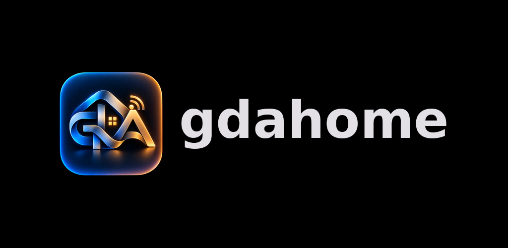
</p>

<h3 align="center">La tua casa in una plancia. Anche fuori casa, senza aprire porte.</h3>

<p align="center">
  Home Assistant sul telefono, in una pagina fatta per essere guardata:<br>
  le luci, il clima, le tapparelle, le telecamere, i consumi, le persone.
</p>

<p align="center">
  <a href="https://gdahome.org"><b>Il sito</b></a>
  &nbsp;·&nbsp;
  <a href="https://webapp.gdahome.org"><b>Aprila dal browser</b></a>
  &nbsp;·&nbsp;
  <a href="#metterla-in-casa"><b>Come si installa</b></a>
  &nbsp;·&nbsp;
  <a href="#quanto-costa"><b>Prezzi</b></a>
  &nbsp;·&nbsp;
  <a href="#per-chi-installa"><b>Per chi installa</b></a>
  &nbsp;·&nbsp;
  <a href="https://gdahome.org/privacy.html"><b>Privacy</b></a>
</p>

<p align="center">
  <a href="https://github.com/danigio15/gdahomeapp/releases"></a>
  
  
  
  
</p>

<p align="center">
  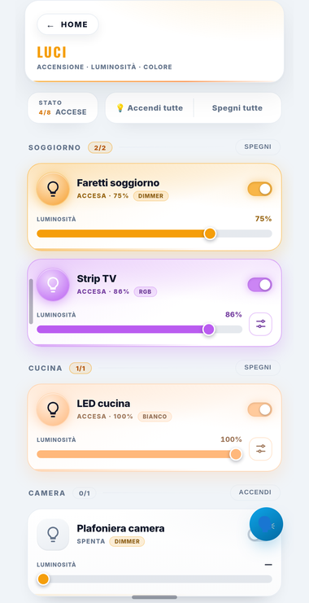
  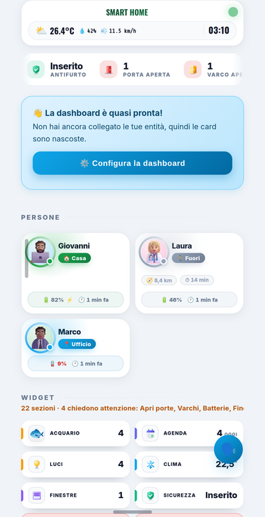
  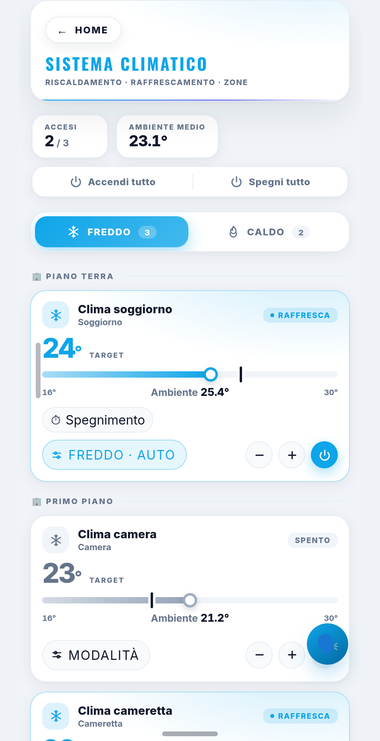
</p>

---

## Com'è fatta

gdahome sono **due pezzi che lavorano insieme**:

| | | |
| :---: | --- | --- |
| 🏠 | **L'add-on**, dentro Home Assistant | Si installa come ogni altro add-on. Porta dentro la plancia, abbina i telefoni e tiene il segreto di Home Assistant: quello non esce mai da lì. |
| 📱 | **L'app**, sul telefono | Per Android e iPhone, e anche dal browser senza installare niente. Si abbina **inquadrando un QR code**: nessun indirizzo da scrivere, nessuna password di Home Assistant, nessun token da copiare. |

Nell'app c'è **la plancia**: una pagina sola con quello che in Home Assistant
sta in dieci pagine diverse. In alto la temperatura, l'antifurto e chi è in
casa; sotto le sezioni — **luci, clima, tapparelle, telecamere, consumi,
persone** e tutte le altre, trenta in tutto — e ogni sezione divisa per stanza.
Si tocca una luce e si accende, si trascina il cursore e cambia il colore.

<table>
<tr>
<td width="62%" align="center" valign="top">
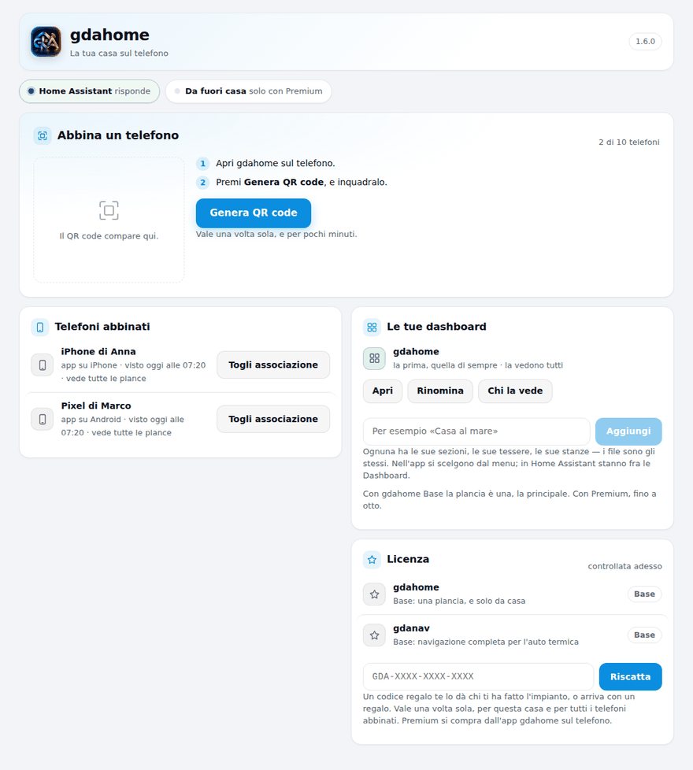
<br><sub><b>L'add-on</b>, in Home Assistant: abbina e stacca i telefoni, tiene le plance e la licenza della casa.</sub>
</td>
<td width="38%" align="center" valign="top">
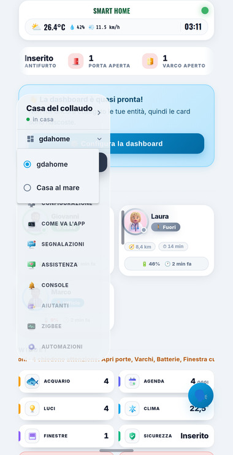
<br><sub><b>L'app</b>, sul telefono: le plance di casa, a un tocco.</sub>
</td>
</tr>
</table>

La plancia si vede anche **senza l'app**: in Home Assistant l'add-on aggiunge
una voce nella barra laterale, e da lì la si apre da qualunque browser di
casa.

## Metterla in casa

**Cosa serve:** un Home Assistant con il **Supervisor**, cioè **Home Assistant
OS** (su Raspberry, mini PC o macchina virtuale) oppure **Home Assistant
Supervised**. Su Home Assistant in Docker gli add-on non esistono:
[vedi le domande](#domande).

**1. Aggiungi l'archivio.** In Home Assistant: **Impostazioni → Add-on →
Negozio degli add-on**, i tre puntini in alto a destra → **Archivi**. Incolla
questo indirizzo e premi **Aggiungi**:

```
https://github.com/danigio15/gdahomeapp
```

**2. Installa gdahome.** Nell'elenco compare la sezione **gdahome**: apri
l'add-on, premi **Installa** e poi **Avvia**. La prima volta ci mette qualche
minuto — su un Raspberry anche dieci — perché Home Assistant lo prepara sul
posto. Gli aggiornamenti poi arrivano come per ogni altro add-on.

**3. Genera il QR code.** Apri **gdahome** dalla barra laterale e premi
**Genera QR code**. Il codice vale una volta sola e per pochi minuti.

<p align="center">
  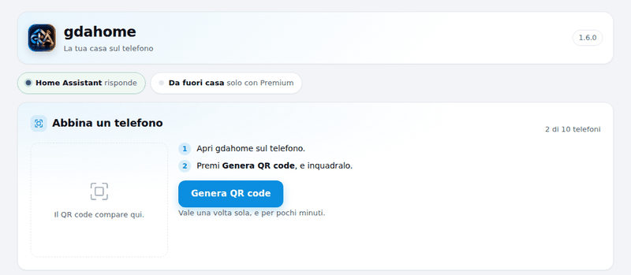
</p>

**4. Inquadralo con l'app.** Scarica gdahome dal **Play Store** (Android) o
dall'**App Store** (iPhone e iPad), oppure apri
**[webapp.gdahome.org](https://webapp.gdahome.org)** dal browser, e inquadra il
codice. Senza fotocamera lo si digita: sedici caratteri, in quattro gruppi.

Fatto: la casa è abbinata. Ogni telefono ha il suo abbinamento, e dalla scheda
dell'add-on lo si toglie con un tasto — per esempio il giorno che un telefono
si perde.

## Cosa fa l'app

<table>
<tr>
<td width="50%" valign="top">

**📋 Le plance.** La plancia principale, e con Premium fino a **30 plance per
casa**: una per la famiglia, una per il piano di sopra, una per l'ufficio.
Ognuna con le sue sezioni e le sue stanze, a un tocco l'una dall'altra.

**🏘️ Più case.** Con Premium fino a **10 case** nella stessa app — casa, casa
al mare, l'ufficio — e si passa dall'una all'altra senza riabbinare.

**🔌 I dispositivi.** Tutte le entità di Home Assistant divise per tipo, con i
loro comandi.

**📡 Zigbee dall'app** _(Premium)_. Si abbina un dispositivo Zigbee dal
telefono, e l'app chiede **«Dove lo metto?»**: finisce direttamente nella
sezione e nella stanza giusta della plancia.

**⚙️ La configurazione dal telefono** _(Premium)_. La plancia si cambia
dall'app: sezioni, stanze, cosa si vede e dove.

**🔄 Gli aggiornamenti di casa.** Nel menu compaiono quelli di Home Assistant,
degli add-on, di gdahome e dei firmware: si installano da lì, e da lì si
riavvia la casa.

**💬 Segnalazioni e assistenza.** Qualcosa non va? Si scrive dall'app, con
foto e video, e arriva a chi sviluppa gdahome. Per una domanda c'è la **chat
di assistenza**, privata.

**🔒 Il lucchetto.** L'app si apre con l'impronta o col volto.

</td>
<td width="50%" valign="top" align="center">

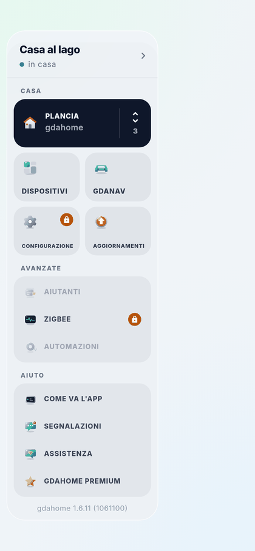
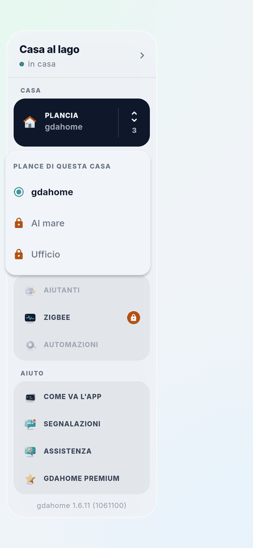
<br>
<sub>Il menu, e le plance della casa. Il lucchetto segna quello che si apre con Premium.</sub>

</td>
</tr>
</table>

### In auto: gdanav, il navigatore

Nell'app c'è anche **gdanav**, un navigatore fatto per l'auto elettrica che
serve anche a chi guida a benzina o a gasolio. Il percorso, i distributori e i
loro prezzi, il traffico, gli autovelox e il meteo lungo la strada. Per
l'elettrica, con Premium: la batteria **letta dall'auto** e il percorso **con
le soste alle colonnine**, col loro stato in tempo reale. Con **Android Auto**
e **CarPlay** la casa è a un tasto: il cancello, il portone, «sto arrivando».

gdanav esiste anche come app a sé, per chi non ha Home Assistant.

<p align="center">
  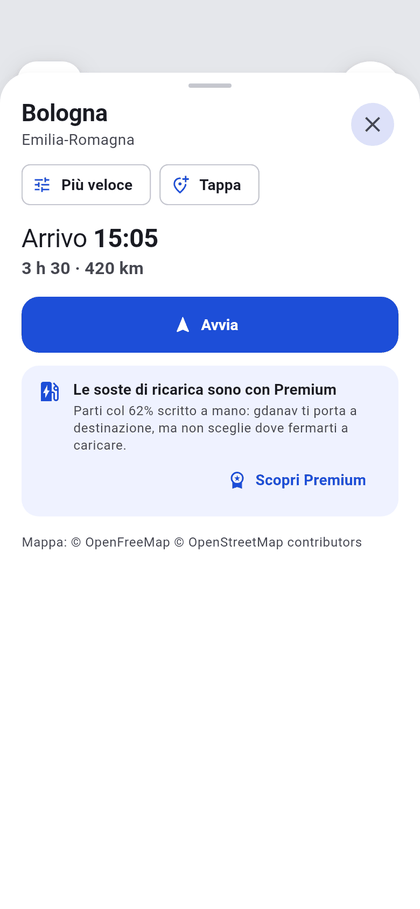
  &nbsp;
  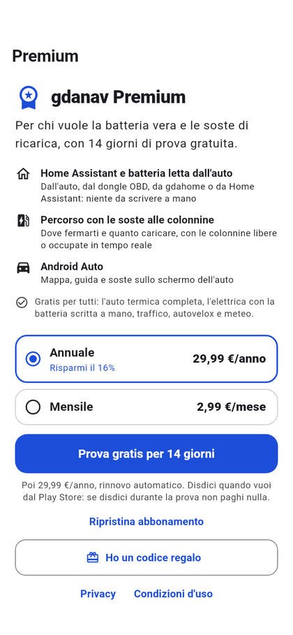
</p>

## Da fuori casa

Sulla rete di casa il telefono parla direttamente con l'add-on. **Con
Premium** la casa si raggiunge anche da fuori — dall'ufficio, in vacanza, col
telefono sui dati — e senza fare niente:

- **nessuna porta da aprire sul router**, nessun indirizzo pubblico da avere,
  nessuna VPN da installare: è la casa a tenere aperto il collegamento verso
  l'esterno, e il telefono la raggiunge da lì;
- **cifrato da un capo all'altro**, fra il telefono e l'add-on: chi sta in
  mezzo fa passare i messaggi ma non li può leggere;
- **si sceglie da solo**: in casa l'app usa la strada diretta, appena esci
  dal portone passa a quella da fuori, senza che tu te ne accorga.

<table>
<tr>
<td width="35%" align="center" valign="top">
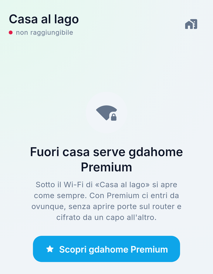
</td>
<td valign="top">

Senza Premium, fuori dal Wi-Fi di casa l'app lo dice chiaramente, e la casa
torna raggiungibile appena si rientra.

Ogni telefono abbinato ha **un accesso suo**, che vale solo per quella casa
e si toglie con un tasto dalla scheda dell'add-on. Il segreto di Home
Assistant non esce mai dall'add-on.

</td>
</tr>
</table>

## Quanto costa

|                                         | **Base**<br>gratis, per sempre     | **Premium**<br>4,99 € al mese · 49,99 € all'anno                |
| --------------------------------------- | :--------------------------------: | :-------------------------------------------------------------: |
| L'add-on e la plancia in Home Assistant | ✅                                  | ✅                                                               |
| Plance                                  | una, la principale                 | fino a **8** per casa                                           |
| Case nell'app                           | una                                | fino a **10**                                                   |
| Dove funziona                           | sulla rete di casa                 | **anche da fuori casa**, cifrato, senza aprire porte            |
| Configurare la plancia dal telefono     | —                                  | ✅                                                               |
| Aggiungere dispositivi Zigbee dall'app  | —                                  | ✅ con «Dove lo metto?»                                          |
| gdanav, il navigatore                   | la versione gratis                 | **gdanav Premium compreso**                                     |
| Segnalazioni e chat di assistenza       | ✅                                  | ✅                                                               |
| Account da fare                         | nessuno                            | nessuno                                                         |

> **I primi 14 giorni di Premium sono gratis**, la prima volta: si prova
> tutto, e se non serve si disdice dal Play Store o dall'App Store prima che
> finiscano.

<p align="center">
  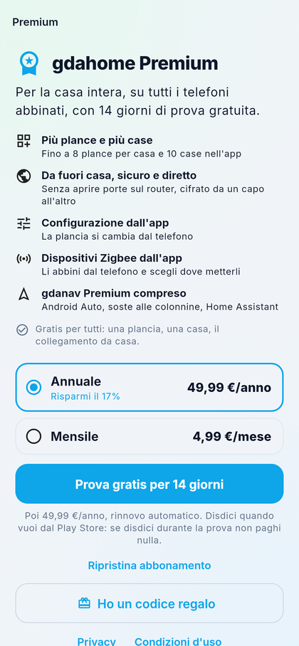
  &nbsp;&nbsp;
  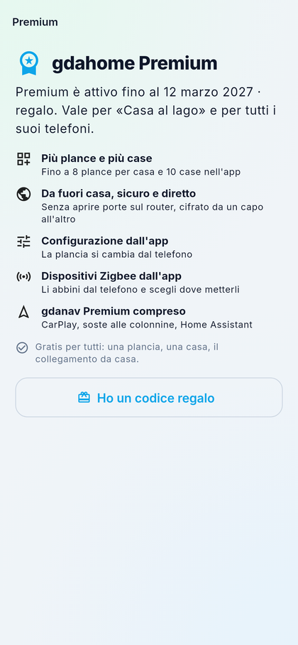
</p>
<p align="center"><sub>La pagina Premium nell'app, e la stessa pagina con Premium attivo per tutta la casa.</sub></p>

### Premium è della casa, non del telefono

Si attiva **una volta per la casa**, e tutti i telefoni abbinati a quella casa
sono Premium insieme a lei — anche l'app dal browser. Chi abita con te non
paga un'altra volta.

### Come si ha

<table>
<tr>
<td valign="top">

**🛒 Dall'app.** Pagina **Premium**, piano mensile o annuale. Si paga con
Google Play o con l'App Store, e si disdice da lì come ogni altro
abbonamento. Dal browser non si compra: si compra dal telefono, e vale anche
lì.

**🎁 Con un codice regalo**, fatto così: `GDA-XXXX-XXXX-XXXX`. Si scrive
nell'app, **Premium → Ho un codice regalo** (anche dal browser), oppure nella
scheda dell'add-on in Home Assistant. Vale una volta sola.

**🧰 Dal tuo installatore.** Se l'impianto te l'ha fatto un installatore, può
darti lui Premium: o lo assegna direttamente alla tua casa — e non c'è niente
da fare, l'app lo sa già — o ti manda un codice regalo.

</td>
<td width="34%" align="center" valign="top">
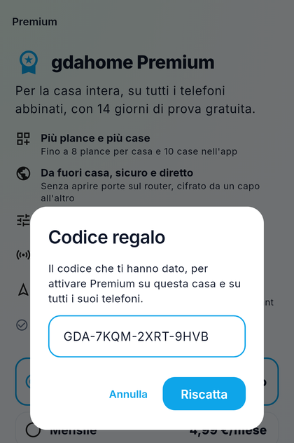
<br><sub>Un codice regalo, scritto nell'app.</sub>
</td>
</tr>
</table>

<table>
<tr>
<td width="50%" align="center" valign="top">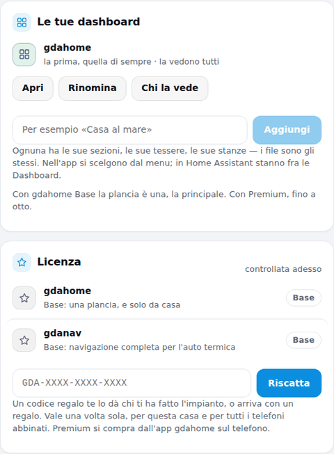<br><sub>Base: una plancia, e solo da casa.</sub></td>
<td width="50%" align="center" valign="top">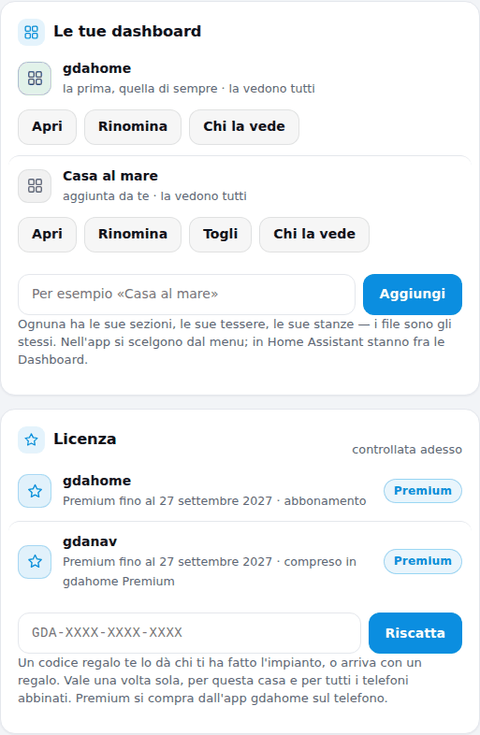<br><sub>Premium: la seconda plancia, e gdanav compreso.</sub></td>
</tr>
</table>

La stessa casa in Home Assistant, prima e dopo: la licenza si vede anche nella
scheda dell'add-on, e il codice regalo si può scrivere lì.

### Quando finisce

Non si perde niente. La casa torna Base: la plancia principale resta, e le
plance in più restano salvate dove sono — si rivedono appena Premium torna.

### gdanav da solo

|                            | **gdanav**<br>gratis                                   | **gdanav Premium**<br>2,99 € al mese · 29,99 € all'anno         |
| -------------------------- | :----------------------------------------------------: | :-------------------------------------------------------------: |
| Auto a benzina o gasolio   | completa: percorso, distributori, prezzi               | completa                                                        |
| Auto elettrica             | batteria scritta a mano, percorso senza soste          | batteria **letta dall'auto**, **soste alle colonnine** in tempo reale |
| Traffico, autovelox, meteo | ✅                                                      | ✅                                                               |
| Home Assistant             | —                                                      | ✅                                                               |
| Android Auto e CarPlay     | —                                                      | ✅                                                               |

Anche gdanav Premium ha **i primi 14 giorni gratis**. E con **gdahome Premium
è già compreso**: la casa Premium sblocca tutto anche nel navigatore, senza un
secondo abbonamento.

## Per chi installa

Se metti in piedi impianti Home Assistant per i tuoi clienti, gdahome ha una
parte per te: **il cruscotto per installatori**. Una pagina sola con tutti gli
impianti che segui, e da lì le licenze Premium da dare ai clienti.

<p align="center">
  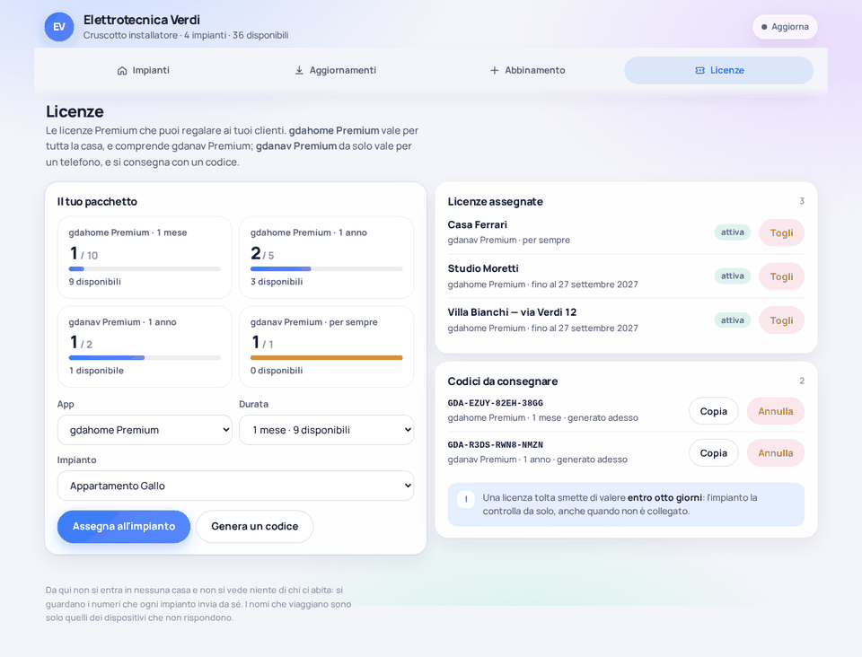
</p>
<p align="center"><sub>Il cruscotto: il pacchetto di licenze diviso per durata, le licenze assegnate alle case, i codici regalo da consegnare.</sub></p>

**🩺 Come sta ogni casa.** Tutti gli impianti in una pagina, e in cima quelli
che chiedono qualcosa adesso. Per ogni casa **dieci controlli al giorno**: la
plancia, i telefoni, il collegamento da fuori, gli aggiornamenti, gli add-on,
la rete, la macchina (processore, memoria, disco, temperatura), il backup, le
batterie dei dispositivi. E **un avviso quando una casa smette di farsi
sentire**, e uno quando riprende: te ne accorgi prima che il cliente ti
telefoni.

**🛠️ Da lontano, solo dove il cliente lo permette.** Installare gli
aggiornamenti, riavviare Home Assistant, sistemare la plancia — le sezioni, le
stanze, dove sta una presa nuova — senza andare sul posto. Sono **interruttori
nella scheda dell'add-on del cliente, spenti di serie**: li accende e li
spegne chi abita la casa.

**🎟️ Le licenze Premium per i clienti.** gdahome ti dà un **pacchetto di
licenze**, diviso per durata — per esempio 10 da un mese, 5 da un anno, 2 per
sempre. Per ognuna scegli:

- **assegnarla a una delle tue case**: da quel momento la casa è Premium, e
  il cliente non deve fare niente;
- **oppure generare un codice regalo** da mandare al cliente: la durata parte
  quando lo riscatta.

Una licenza tolta, o un codice annullato prima di essere usato, **torna nel
tuo pacchetto**. Nel pacchetto possono esserci anche licenze **gdanav
Premium**, per chi vuole solo il navigatore.

**🙈 Cosa non vedi.** Non apri la plancia del cliente e non entri in casa sua:
ricevi numeri, non nomi. Stanze, persone e telecamere restano sue — le
immagini delle telecamere non escono mai di casa, nemmeno mentre sistemi la
plancia.

### Come si comincia

1. **Chiedi l'accesso** dalla pagina dei contatti del sito:
   **[gdahome.org/#contatti](https://gdahome.org/#contatti)**. Ricevi il codice
   del tuo cruscotto e il tuo pacchetto di licenze.
2. Sul **tuo** Home Assistant, nella configurazione dell'add-on gdahome,
   accendi la parte **per chi installa** e scrivi il codice: compare il
   cruscotto, nella barra laterale e nell'app.
3. Per ogni cliente, **dal cruscotto generi un codice di abbinamento**: il
   cliente lo incolla nella configurazione del suo add-on, e da quel momento
   la sua casa compare nella tua pagina — e in nessun'altra. Se vuole, la sua
   plancia porta il tuo nome e il tuo logo: il giorno che qualcosa non va, sa
   chi chiamare.

## I tuoi dati

**I dati della casa restano in casa.** Nessun account, nessuna pubblicità,
nessun tracciamento. Da fuori casa i messaggi viaggiano cifrati fra il
telefono e l'add-on. Per sapere se una casa è Premium, l'add-on manda solo un
identificativo anonimo della casa: niente nomi, dispositivi, stati o
posizione. Il pagamento lo gestiscono Google e Apple: a gdahome non arrivano
né il tuo nome né i dati della carta.

Tutto per intero, anche per il navigatore, la fotocamera e le segnalazioni:
**[l'informativa sulla privacy](https://gdahome.org/privacy.html)**
([`docs/PRIVACY.md`](docs/PRIVACY.md)).

## Domande

**Si installa su Home Assistant in Docker?**
No, e non dipende da gdahome: su **Home Assistant Container** (l'immagine
Docker da sola) e su **Home Assistant Core** il negozio degli add-on non
esiste, e nessun add-on si installa. Serve il Supervisor.

| Home Assistant | gdahome |
| --- | :---: |
| **OS** — il sistema completo, su Raspberry, mini PC o macchina virtuale | ✅ |
| **Supervised** — Debian con l'installatore ufficiale | ✅ |
| **Container** — l'immagine Docker da sola | ❌ nessun add-on, di nessuno |
| **Core** — in un ambiente Python | ❌ idem |

Chi ha Container può passare a **Supervised** sulla stessa macchina: Docker ce
l'ha già.

**L'add-on serve solo per usare l'app?**
No. La plancia compare anche in Home Assistant, nella barra laterale, e si
guarda e si configura da qualunque browser di casa. Con l'app diventa una casa
in tasca.

**Devo installare anche l'integrazione DashboardModern?**
No: la plancia è già dentro l'add-on. Chi l'integrazione ce l'ha già e ci ha
configurato la plancia non ricomincia da zero: alla prima apertura gdahome
prende quella configurazione e la usa.

**Siamo in quattro in casa: paghiamo quattro volte?**
No. Premium è della casa: tutti i telefoni abbinati, e l'app dal browser, sono
Premium insieme.

**Il mio installatore mi ha dato un codice. Dove lo metto?**
Nell'app, **Premium → Ho un codice regalo**, oppure nella scheda dell'add-on in
Home Assistant. Se invece la licenza l'ha assegnata lui alla casa, non c'è
niente da fare.

**Ho perso il telefono.**
Apri gdahome in Home Assistant e, fra i **telefoni abbinati**, premi **Togli
associazione** accanto a quello perso: da quel momento non entra più.

**Dove finiscono le cose che segnalo?**
Nelle [segnalazioni di questa repository](https://github.com/danigio15/gdahomeapp/issues):
si scrivono dall'app — **Segnalazioni** nel menu, con foto e video — senza
bisogno di un account GitHub. Per chiedere aiuto c'è **Assistenza**, una
conversazione privata che non finisce su nessuna pagina pubblica.

## Sostieni il progetto

Il sostegno è **separato da Premium**: non sblocca niente e non diventa uno
sconto. Serve a far crescere gdahome e a tenere gratis la versione Base per
tutti.

<p align="center">
  <a href="https://github.com/sponsors/danigio15"></a>
  &nbsp;
  <a href="https://www.paypal.com/paypalme/giovannidaniello15"></a>
</p>

E due modi di aiutare che non costano niente: una ⭐ a questa repository, e una
[segnalazione scritta bene](https://github.com/danigio15/gdahomeapp/issues) —
cosa stavi facendo, cosa ti aspettavi, cosa è successo. Il resto sta in
[`docs/SOSTEGNO.md`](docs/SOSTEGNO.md).

## Licenza

Il codice di gdahome è in questa repository, con la sua licenza
([`LICENSE`](LICENSE)): si legge e si controlla cosa fa, ma non è open source.
La plancia è DashboardModern, con la sua licenza.

---

<sub>Per chi sviluppa: [`docs/SVILUPPO.md`](docs/SVILUPPO.md).</sub>
