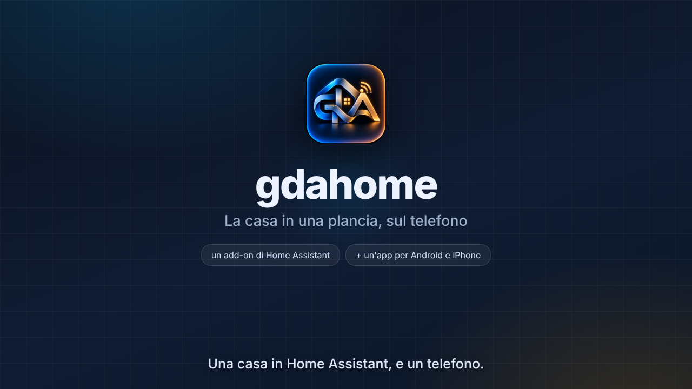

# Il video: cos'è gdahome, e come si installa

Un filmato di due minuti e mezzo che fa vedere le due installazioni — **l'add-on
dentro Home Assistant** e **l'app sul telefono** — più quello che c'è intorno:
cos'è gdahome, come ci si arriva da casa e da fuori, il codice da inquadrare, la
plancia.

Il file è **`gdahome-presentazione.webm`**, 1280×720, senza suono. Si apre in
qualunque browser, si carica su YouTube e su GitHub, e si manda in un messaggio.



## Rifarlo

```
node strumenti/video/rendi.mjs
```

Cinque minuti circa. Serve **Playwright** (`npm i -g playwright`, oppure
installato di fianco al progetto) e nient'altro: il ffmpeg che serve se lo porta
dietro Playwright, e se sulla macchina ce n'è uno vero si usa quello.

Mentre si lavora a una scena conviene non rifare tutto:

```
node strumenti/video/rendi.mjs --scena il-codice       una scena sola
node strumenti/video/rendi.mjs --foto il-codice@3.2    una fotografia, in provini/
node strumenti/video/rendi.mjs --foto "a@1,b@2.5"      più d'una
```

I nomi delle scene sono quelli che passa `scena(...)` in `scene.js`, e la ripresa
li stampa mentre va.

## Com'è fatto

| file | cosa fa |
|---|---|
| `presentazione.html` | il palco: le misure, i colori, i caratteri, le animazioni |
| `scene.js` | le quattordici scene, una funzione ciascuna, e quello che chi filma può chiedere alla pagina |
| `rendi.mjs` | chi filma: apre la pagina, sposta l'orologio, scatta, e passa gli scatti a ffmpeg |
| `quadretto.svg` | il QR che si vede nel filmato — lo rifà `rendi.mjs` a ogni ripresa |
| `provini/` | le fotografie di `--foto`, per guardare com'è venuta una scena |

**Il tempo non passa: glielo si dice.** Le animazioni della pagina stanno ferme
(`animation-play-state: paused`), e per ogni fotogramma chi filma porta
l'orologio di tutte al momento che gli serve e scatta. Una registrazione dal
vivo dipenderebbe da quanto è carico il computer, e due riprese darebbero due
file diversi; così sono venticinque fotogrammi al secondo esatti, sempre gli
stessi. Finita l'ultima animazione di una scena, chi filma se ne accorge e
rimanda l'ultimo scatto invece di rifarlo — è il motivo per cui una scena ferma
per sei secondi non costa sei secondi di ripresa.

Due regole per chi ci mette mano, e sono scritte anche in cima al documento:

* **niente animazioni infinite** — un puntino che pulsa per sempre toglie quella
  scorciatoia e triplica il tempo di ripresa;
* **quello che compare dopo parte nascosto**, con `opacity: 0` nel foglio di
  stile e l'animazione in `forwards`: è il solo modo perché due animazioni sulla
  stessa proprietà — una che mostra, una che nasconde più tardi — non si pestino
  i piedi.

## Quello che si vede è roba di qui dentro

Il marchio è `app/assets/marchio/gda.png`, quello dell'icona dell'app. I
caratteri sono gli Inter di `app/assets/carattere/`, gli stessi dell'app. I
disegni delle tessere sono gli SVG di `app/assets/oggetti/`, gli stessi della
plancia. I colori sono quelli di `app/lib/vestito/tema.dart`.

**Il quadretto è vero**: lo disegna `ponte/src/qr.js`, l'encoder dell'add-on, e
non un quadrato finto messo lì per somiglianza. Quello che ci sta scritto invece
è finto e lo dice: chi lo inquadra si trova in mano
`gdahome://codice-finto-del-video/non-abbina-niente`, non un abbinamento.

Le finestre di Home Assistant e la pagina del negozio del telefono sono
**ricostruite**, non catturate: servivano una casa vera e un'app pubblicata, e
la seconda non c'è ancora.

## La scena del Play Store dice che è un'anteprima

L'app **sui negozi non c'è ancora** — nel README sta fra le cose da fare, e
`COME_PROVARLA.md` spiega le strade che funzionano oggi. La scena che fa vedere
«Installa» sul telefono porta scritto in alto **«Anteprima: sui negozi non c'è
ancora»**, e subito dopo viene la scena con i tre modi veri: dal browser,
l'apk da GitHub, e TestFlight per l'iPhone.

Il giorno che l'app va sui negozi, quella scena si toglie l'etichetta e la scena
dopo si accorcia: sono due righe in `scene.js`.

## Il suono

Non c'è, e non per dimenticanza: il ffmpeg di Playwright sa fare il video e
basta. Le parole stanno scritte sul filmato, ed è anche il modo in cui lo
guardano quasi tutti — un video di installazione si guarda col telefono in
silenzio.

Chi vuole leggere il parlato ha il copione in [`copione.md`](copione.md), scena
per scena, con i tempi. Registrata una traccia, con un ffmpeg vero si attacca
senza rifare il video:

```
ffmpeg -i gdahome-presentazione.webm -i voce.m4a \
       -c:v copy -c:a libopus -shortest gdahome-con-voce.webm
```

## Cambiare le parole

Le didascalie stanno dentro le scene, in `didascalia([...])`: ogni riga ha
quando entra (`t`) e quando esce (`t2`), in secondi dall'inizio della scena. Se
si allunga una riga bisogna guardare che ci stia: il palco è largo 1280 e le
didascalie hanno 120 pixel di margine per parte.

## Le fotografie di prova

`provini/` non sta nella repository: ci finiscono le fotografie di `--foto` e i
filmati di `--scena`, che si rifanno con un comando. La copertina invece sì —
`copertina.png`, il fotogramma dell'apertura, rifatto a ogni ripresa intera.
