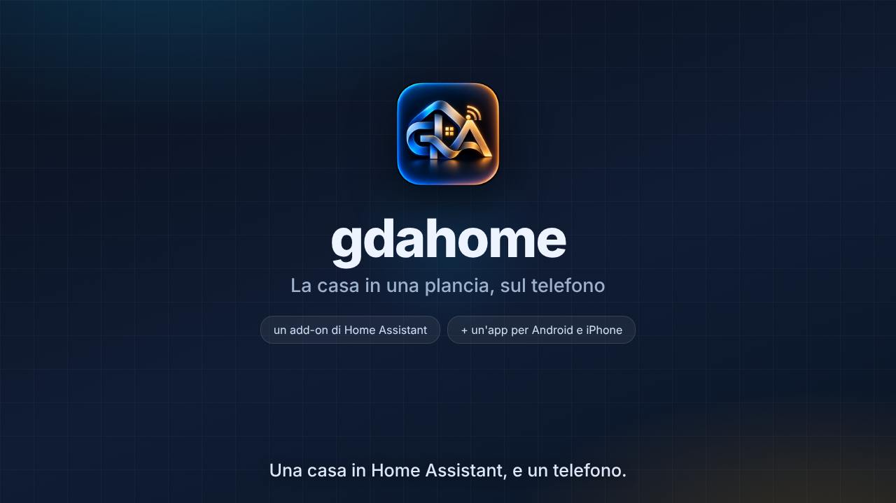

# I video di gdahome

Tre filmati, fatti dalla stessa pagina web e dalla stessa cartella:

| film | misura | dura | a cosa serve |
|---|---|---|---|
| `gdahome-presentazione` | 1280×720 | 2:49 | quello che spiega: cos'è, come si installa l'add-on, come si abbina il telefono, quanto costa (niente) |
| `gdahome-facebook` | 1080×1080 | 0:47 | il quadrato per il feed di Facebook |
| `gdahome-tiktok` | 1080×1920 | 0:47 | lo stesso, in piedi, per TikTok — e per Reels e Storie |

Escono in **mp4** (H.264, con una traccia audio muta nei due corti) se sulla
macchina c'è un ffmpeg vero; se c'è solo quello di Playwright escono in webm,
e la ripresa lo dice. Per i negozi dei video serve l'mp4: TikTok un webm non lo
prende.



## Rifarli

```
node strumenti/video/rendi.mjs                 tutti e tre
node strumenti/video/rendi.mjs --film tiktok   uno solo
```

Sette minuti circa per tutti e tre. Serve **Playwright** (`npm i -g playwright`,
oppure installato di fianco al progetto) e, per l'mp4, **ffmpeg**
(`apt install ffmpeg`). Nient'altro.

Mentre si lavora a una scena conviene non rifare tutto:

```
node strumenti/video/rendi.mjs --film tiktok --scena il-gancio   una scena, in provini/
node strumenti/video/rendi.mjs --foto il-gancio@3.2              una fotografia
node strumenti/video/rendi.mjs --foto "a@1,b@2.5"                più d'una
```

I nomi delle scene sono quelli che passa `scena(...)`, e la ripresa li stampa
mentre va.

## Com'è fatto

| file | cosa fa |
|---|---|
| `comune.css` | quello che i tre film hanno in comune: caratteri, colori, il fondo del palco, le animazioni, il telefono, le schede |
| `pezzi.js` | i pezzi condivisi: il marchio, i disegnini, il telefono, **la plancia**, e il palco che chi filma va a cercare |
| `presentazione.html` + `scene.js` | il film lungo: quindici scene, disposte a coordinate |
| `social.html` + `social.js` | il film corto: sette scene, disposte **a colonna** |
| `rendi.mjs` | chi filma: apre la pagina, sposta l'orologio, scatta, e passa gli scatti a ffmpeg |
| `quadretto.svg` | il QR che si vede nel film lungo — lo rifà `rendi.mjs` a ogni ripresa |
| `provini/` | le fotografie di `--foto` e i filmati di `--scena`; non sta nella repository |

**Il tempo non passa: glielo si dice.** Le animazioni della pagina stanno ferme
(`animation-play-state: paused`), e per ogni fotogramma chi filma porta
l'orologio di tutte al momento che gli serve e scatta. Una registrazione dal
vivo dipenderebbe da quanto è carico il computer, e due riprese darebbero due
file diversi; così sono venticinque fotogrammi al secondo esatti, sempre gli
stessi. Finita l'ultima animazione di una scena, chi filma se ne accorge e
rimanda l'ultimo scatto invece di rifarlo — è il motivo per cui una scena ferma
per sei secondi non costa sei secondi di ripresa.

Due regole per chi ci mette mano, e sono scritte anche in cima ai documenti:

* **niente animazioni infinite** — un puntino che pulsa per sempre toglie quella
  scorciatoia e triplica il tempo di ripresa;
* **quello che compare dopo parte nascosto**, con `opacity: 0` nel foglio di
  stile e l'animazione in `forwards`: è il solo modo perché due animazioni sulla
  stessa proprietà — una che mostra, una che nasconde più tardi — non si pestino
  i piedi.

### Un film solo per due negozi

Facebook e TikTok ricevono **lo stesso film**: cambia quanto è alto il palco e
quanta aria si lascia sopra e sotto, e a dirlo è l'indirizzo della pagina —
`social.html?alto=1920&su=210&giu=390&zoom=1.15`. Le misure stanno in `rendi.mjs`,
in cima, una riga per film.

L'aria sotto non è un gusto: su TikTok lì ci stanno il testo, i tasti e il nome
di chi pubblica, e quello che ci finisce sotto non lo legge nessuno. Per questo
le scene del film corto non sono disposte a coordinate come quelle del film
lungo, ma **a colonna**: si mettono in fila e si dispongono da sole con lo
spazio che trovano, che in un quadrato e in un palco in piedi è diverso.

## Quello che si vede è roba di qui dentro

Il marchio è `app/assets/marchio/gda.png`, quello dell'icona dell'app. I
caratteri sono gli Inter di `app/assets/carattere/`, gli stessi dell'app. I
disegni delle tessere sono gli SVG di `app/assets/oggetti/`, gli stessi della
plancia. I colori sono quelli di `app/lib/vestito/tema.dart`. E la plancia che
si vede nel telefono è **una sola**, in `pezzi.js`: tre film che disegnano tre
plance leggermente diverse sarebbero tre prodotti.

**Il quadretto è vero**: lo disegna `ponte/src/qr.js`, l'encoder dell'add-on, e
non un quadrato finto messo lì per somiglianza. Quello che ci sta scritto invece
è finto e lo dice: chi lo inquadra si trova in mano
`gdahome://codice-finto-del-video/non-abbina-niente`, non un abbinamento.

Le finestre di Home Assistant e la pagina del negozio del telefono sono
**ricostruite**, non catturate: servivano una casa vera e un'app pubblicata.

## Le date, e dove stanno scritte

I tre film dicono le stesse tre cose, e quando cambiano vanno cambiate in tutti
e tre:

- **da subito**: l'add-on, la plancia, e l'app dal browser;
- **dal 30 settembre**: l'app per Android, negli store;
- **in fase di sviluppo**: la versione per iOS.

Nel film lungo stanno nella scena `dal-negozio-del-telefono` (la targhetta in
alto) e in `come-si-prova-oggi` (la pastiglia); nel film corto, nella scena
`da-quando`.

## Il suono

Non c'è, e non per dimenticanza: le parole stanno scritte sul filmato, ed è
anche il modo in cui lo guardano quasi tutti — un video di installazione si
guarda col telefono in silenzio, e uno sui social pure.

Nei due corti c'è però una traccia audio **muta**: un negozio che riceve un
video senza nessuna traccia ogni tanto lo rifiuta, e accorgersene mentre si
pubblica è la cosa peggiore.

Chi vuole leggere il parlato ha il copione in [`copione.md`](copione.md), scena
per scena, con i tempi. Registrata una traccia, si attacca senza rifare il
video:

```
ffmpeg -i gdahome-tiktok.mp4 -i voce.m4a -map 0:v -map 1:a \
       -c:v copy -c:a aac -shortest gdahome-tiktok-con-voce.mp4
```

## Cambiare le parole

Nel film lungo le didascalie stanno in `didascalia([...])`: ogni riga ha quando
entra (`t`) e quando esce (`t2`), in secondi dall'inizio della scena. Nel film
corto le parole sono la scena: si cambiano dove sono scritte.

Se si allunga una riga bisogna guardare che ci stia — e guardarlo **in tutti e
due i palchi**, perché quello che sta in una riga sul quadrato in piedi può
andare a capo.
